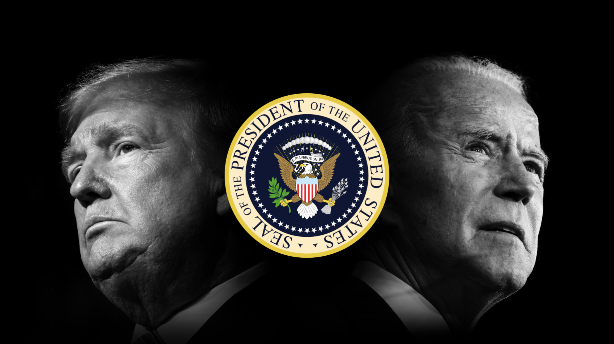

# Twitter Sentiment Analysis US Elections 2020

* In our Text Analytics class final project, we completed a sentiment analysis of 35,000 tweets in different states to identify voter sentiment and topics interest during the 2020 predidential elections. Analysis done in the following segments:

1. Biden v/s Trump Sentiment
2. Topic Modelling for issues of importance in battleground states
3. Sentiment Analysis for issues of importance discovered in point 2

